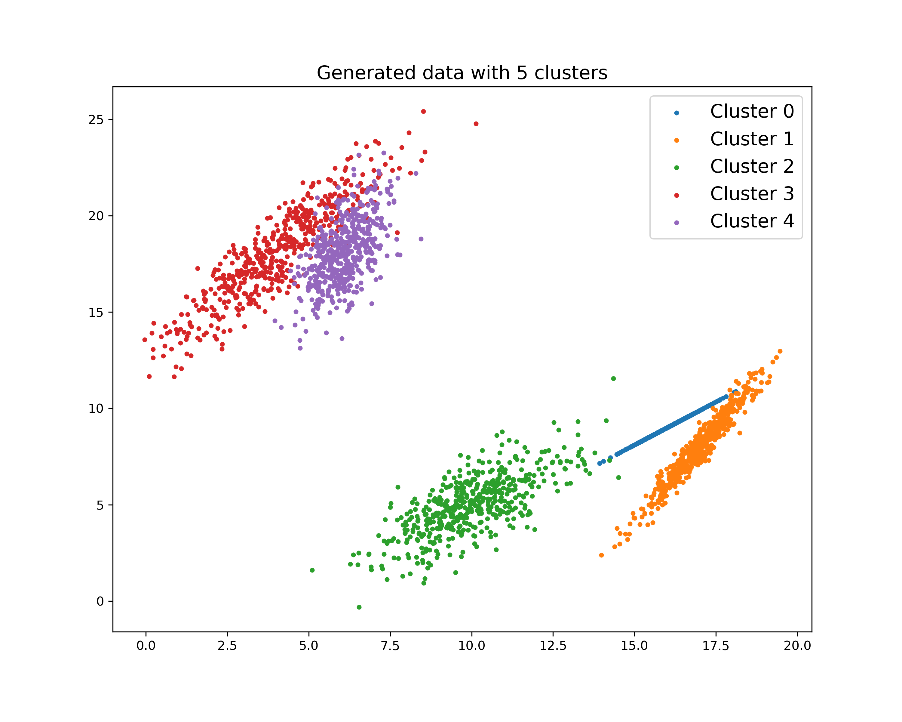
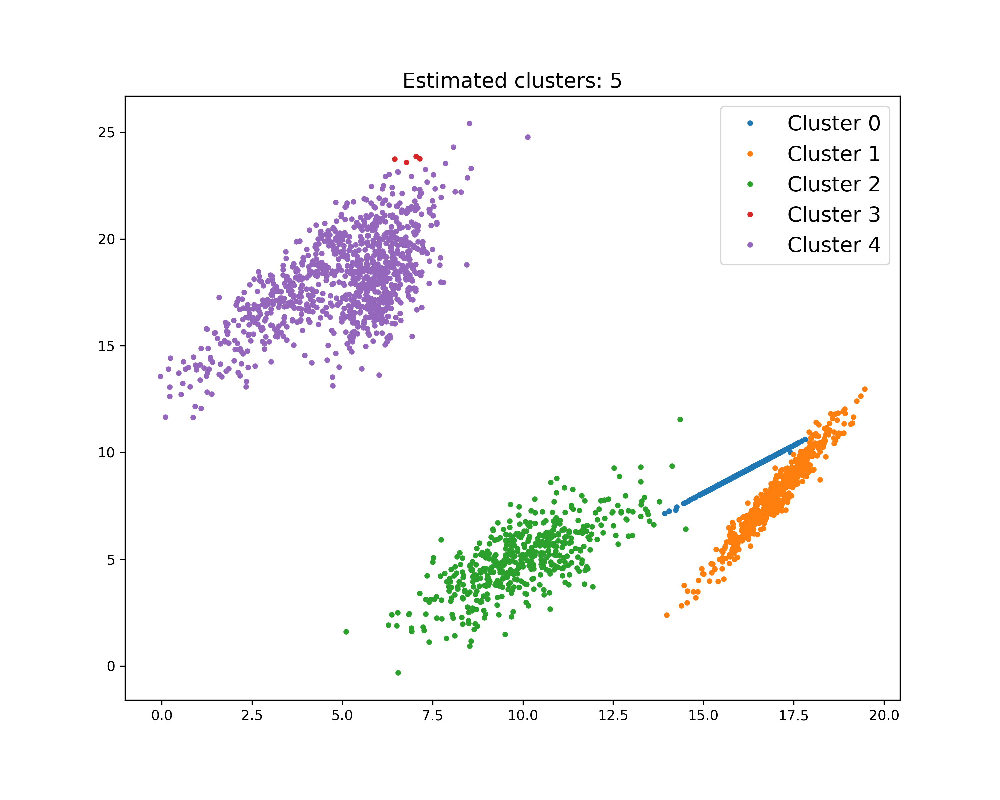

# MAP-DP

MAP-DP clustering algorithm.

I am NOT the owner of this amazing algorithm, this is just a way to archive this code to easily integrate it into my own projects. 

Original code shared under CC BY-NC-SA 3.0

[license](https://creativecommons.org/licenses/by-sa/3.0/)

**Full credits go to:**

Y.P. Raykov, A. Boukouvalas, F. Baig, M.A. Little (2016), What to do when K-means clustering fails: a simple yet principled alternative algorithm, PLoS One 11 (9), e0162259

[Published paper link](http://www.maxlittle.net/publications/MAP-DP_Raykov_PLoS_One_2016_preprint.pdf)

## Examples

I have included some examples with different data and settings to illustrate how well the algorithm works. I share the visualizations here below:

### Example 1: Gaussian Mixture Model

Generated data image             |  Clustering results
:-------------------------:|:-------------------------:
  |  
